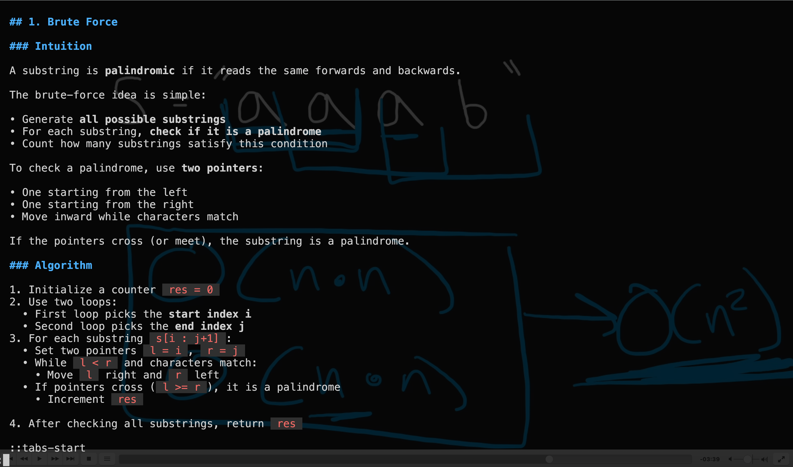

# LeetDeeper 🧠💀

> Because apparently building production systems that serve millions of users isn't enough. You also need to reverse a linked list on a whiteboard while a stranger watches you sweat.

**Deliberate algorithm practice for engineers who refuse to let AI make them dumber.**

Can't get laid off if you've already downloaded the entire interview prep internet. 📼



---

## 🔥 What This Actually Is

A full offline interview prep war room. 600+ videos from 5 sources, 4 curated problem lists, practice scaffolds in TypeScript, Python, Elixir, Go, Rust, whatever—LLMs are magic and languages are just syntax. Progress tracking, an AI study buddy that helps you learn without spoiling answers, and an absurdly over-engineered automation pipeline that would probably impress interviewers more than the actual LeetCode solutions.

**Incident report:** 75 Vitest worker threads × 8 CPU cores = 600 concurrent processes. Accidental fork bomb 💣🍴💥. Machine frozen. Lesson learned. `npx vitest run .` targets ONE problem. Never again.

## 🎯 The Grind

```
1. 📺 Watch NeetCode explain it          (VLC, 2x speed, you're not a beginner)
2. 📖 Skim the article simultaneously    (transparent kitty terminal over VLC — video behind, glow markdown in front)
3. 🧠 Understand the PATTERN, not the code
4. ⌨️  Implement it yourself              (TypeScript, Python, Elixir, whatever compiles your feelings)
5. 📝 Record insights in notes.md         (the real treasure)
6. 🔄 Repeat until employed
```

## 🏗️ The Stack

| Tool | Why |
|------|-----|
| **NeoVim** | Because VS Code is for people who haven't been humbled by Vim yet |
| **Kitty** | GPU-accelerated terminal with transparency. Video plays behind, article renders on top via [glow](https://github.com/charmbracelet/glow) (a markdown renderer written in Go). Simultaneously watch and read. 👻 |
| **Claude Code** | AI pair programmer that tracks progress, manages downloads, and once accidentally fork-bombed my laptop 💣 |
| **[LeetDreamer](https://github.com/joshribakoff/leetdreamer)** | Sister project. Write JSON, get a video where a robot explains sliding window while boxes dance. |
| **VLC** | 2x speed. No ads. Offline. Like YouTube but without the existential dread. |

## 🎬 LeetDreamer

Sister project: **[joshribakoff/leetdreamer](https://github.com/joshribakoff/leetdreamer)**

Finally understand an algorithm? Prove it before you forget. Write a JSON scene spec, get a narrated animation where a robot voice explains sliding window while color-coded boxes dance across the screen. Built with a modular pipeline (TTS, HTML animation, Playwright recording, FFmpeg merging) because obviously the correct response to "I understand two pointers now" is to build a video production pipeline. 🎥🤖

## 📼 The Library

Why stream when you can hoard? 600+ videos across 5 sources, rate-limited downloads running in the background while you grind. YouTube's rate limiter vs my download script is the real algorithmic battle.

| Source | What You Get | Videos |
|--------|-------------|--------|
| 🎓 **NeetCode** | Blind 75 + every pattern playlist (DP, Trees, Graphs, Backtracking, Binary Search, Linked List, Stack, Sliding Window) | ~300 |
| ⚡ **Kevin Naughton** | Speedrun walkthroughs, no fluff, 124 LeetCode problems | 124 |
| 🧮 **Abdul Bari** | Makes algorithms actually make sense | 84 |
| 📚 **mycodeschool** | Data Structures, Sorting, Recursion, Time Complexity | ~80 |
| 🏛️ **MIT 6.006** | For when you want to feel smart and confused simultaneously | 34 |

```bash
pip install yt-dlp
python scripts/download_playlists.py    # Rate-limited. YouTube is watching. 👀
```

## 📋 Problem Lists

4 curated lists, 75+ problems each, scaffolded with test cases:

- 🔥 **Blind 75** — The OG interview prep list
- 📈 **NeetCode 150** — Extended NeetCode roadmap
- 💪 **Grind 75** — Tech interview grind list
- 🏆 **AlgoMaster 75** — Algorithm mastery list

## 📊 Progress Tracking

```bash
python scripts/progress_report.py    # Progress bars by pattern
```

Everything is tracked:
- `completed.json` — problems solved (the scoreboard)
- `progress/watched.jsonl` — videos watched (the time investment)
- `notes.md` — edge cases and insights that every explainer skips (the real value)

## 🗂️ The Arsenal

```
leetdeeper/
├── practice/           # Scaffolded problems with test cases
├── notes.md            # Hard-won algorithm intuitions
├── completed.json      # The scoreboard
├── scripts/            # Download automation, progress reports
├── videos/             # Offline video library (doomsday prep 📼)
├── neetcode/           # NeetCode curriculum (submodule)
├── fucking-algorithm/  # Labuladong's algorithm book (the name says it all)
└── leetcode-py/        # Python reference solutions (submodule)
```

## 📦 Knowledge Bases

| Submodule | Description |
|-----------|-------------|
| [neetcode](https://github.com/neetcode-gh/leetcode) | NeetCode's curriculum, solutions in 15+ languages |
| [fucking-algorithm](https://github.com/joshribakoff/fucking-algorithm) | Labuladong's algorithm book 🤌 |
| [leetcode-py](https://github.com/wislertt/leetcode-py) | Python LeetCode solutions |
| [python_leetcode_runner](https://github.com/tusharsadhwani/python_leetcode_runner) | Run LeetCode tests locally |

```bash
git clone --recursive https://github.com/joshribakoff/leetdeeper.git
```

## License

My code is MIT. Submodules have their own licenses.

---

*"The goal isn't to memorize solutions. It's to recognize patterns and understand why they work."*

*Also: if you don't use it, you lose it.* 🧠

*Can't get laid off if you've already downloaded the entire interview prep internet.* 📼
